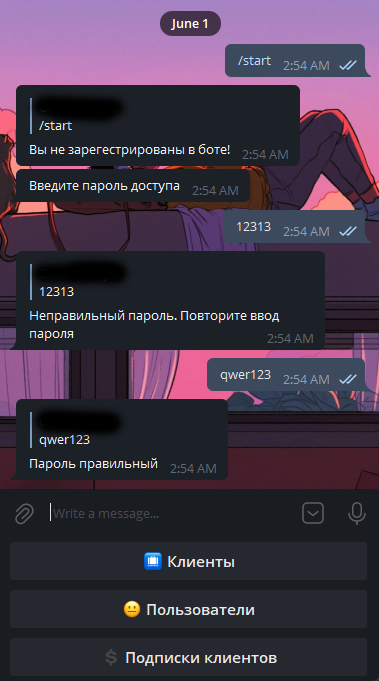
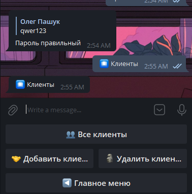
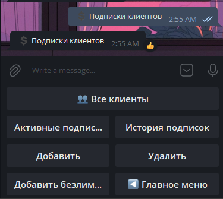

# Secure Commercial Development
### API service in Python for providing customers with subscription access to ready-made *"pieces"* of [1С](https://1c.ru/) code that implement complex tasks.
### API сервис на Python для предоставления клиентам доступа через подписку к готовым *"кускам"* кода [1С](https://1c.ru/), реализующим конкретные задачи.
___

### Стэк технологий
* Python 3.10
* Flask
* PostgreSQL
* 1C
___


### Работа бота

 





---
### Первоначальная настройка приложения
1) установите все необходимые пакеты
    ```
    pip install Flask, psycopg2, cryptography
    ```
2) измените данные для подключения к БД в файле **config.py**
3) создайте необходимые таблицы в PostgreSQL
   ```
   
   ```
   
4) загрузите тестовую конфигурацию в 1С (не поставку)
5) 